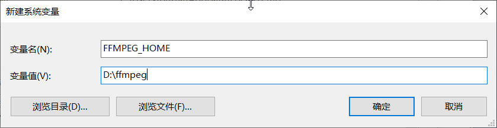
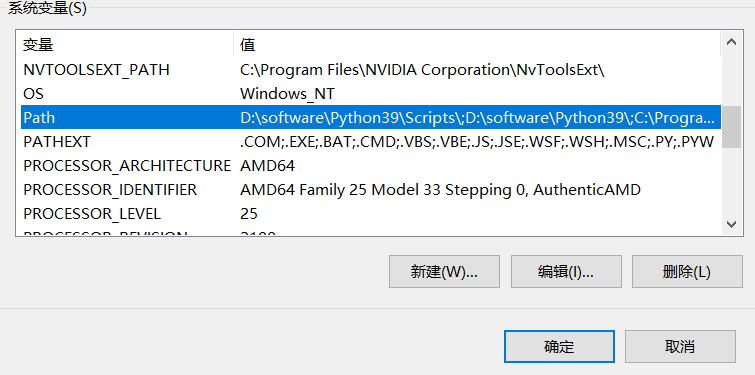
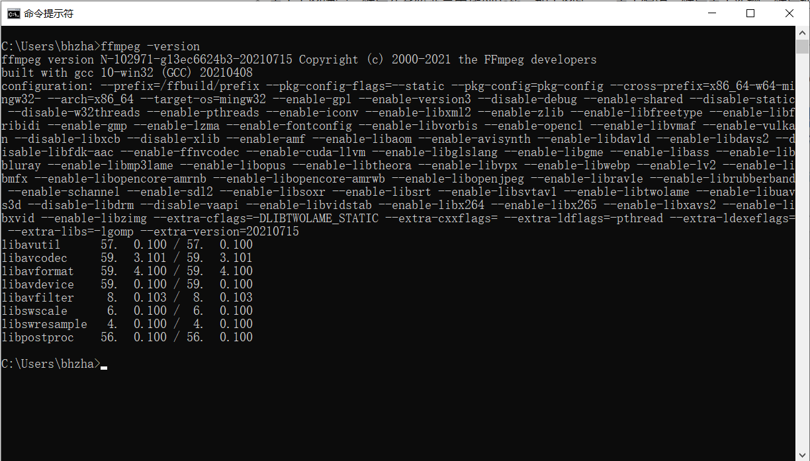
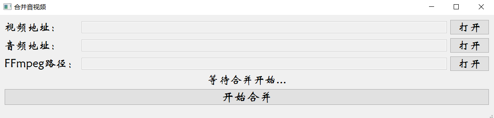

# 视频下载小程序

## 1. 整体

- 整体上使用python you-get模块进行视频下载，对于1080p及以上视频，采用FFmpeg工具来合并音视频文件

- Python安装链接：https://www.python.org/downloads/windows/（非必须，不需要该操作也可以）

- you-get 安装方法（需要先安装python）：打开cmd命令行控制台，输入pip install you-get 即可（非必须，不需要该操作也可以）

- **FFmpeg安装教程（非必须，但是推荐按照流程操作，操作后，程序可自动合并音视频，部分网站1080p以上视频音视频会分离）**

  - 将压缩包里的ffmpeg复制粘贴到电脑合适的位置

  - 然后右击我的电脑（此电脑）--> 属性 --> 高级系统设置 --> 环境变量

    在系统变量（也就是下面那一半）处找到新建，变量名可以采用图片中的名称，变量值是你刚刚把ffmpeg放到的那个位置

    

  - 点击上图确定，然后在系统变量中找到Path，如下图所示，点击编辑，然后点击新增，然后把`%FFMPEG_HOME%`以及`%FFMPEG_HOME%\bin`写入到path中

    

  - 最后测试一下，按下win+R，输入cmd，然后输入ffmpeg --version，如果现实界面如下，则证明已经安装好了！

    

- 全部安装好之后，运行小程序即可

## 2.操作流程

- 界面如图

- 复制视频链接到输入框，点击查看信息，可以查看视频相关信息，然后选择要下载的清晰度，输入 - itag或者-format后的数字，输入到下载标签中选择对应的清晰度，然后点击下载，等待下载完成即可
- **（一般情况下安装好ffmpeg会自动合并，不需要进行该操作！！!如果没有自动合并，支持手动选择合并！）**针对1080以上的视频，YouTube下载后会音视频分离，然后可以点击合并音视频按钮，弹出以下界面

- 然后分别选择下载的音视频地址和FFmpeg.exe（在安装包bin目录下）的地址，然后点击合并视频即可完成音视频合并，合并后的视频文件在源视频文件夹下
